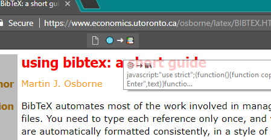

html2biblatex
=============

> Citing a webpage in LaTeX has never been easier!

html2biblatex is a lightweight bookmarklet for exporting web pages to BibLaTeX.

_small - flexible - magic!_

Just click on the html2biblatex bookmark button and paste the collected content into your BibLaTeX code.




--------------------------------------------------------

Installation
------------

 1. Create a new bookmark in the bookmark panel of your browser.
 2. Name it ("🌐 ➜ 📚" or whatever).
 3. URL: [Paste here the content from the file [dist/bookmark-url.js](dist/bookmark-url.js)]

Usage
-----

 1. Load the page you want to cite.
 2. Click on the new bookmark button.
 3. Copy the selected text to clipboard and press [ENTER].
 4. Paste the BibLaTeX entry into
    * your .bib file.
    * JabRef: Just paste it into the open bibliography table.
    * Zotero: Go to 'file' -> 'import from clipboard'.

**Sample output:**

```BibLaTeX
@Online {UsingBibTeXashortguide-2015-11-02,
 title = {Using BibTeX: a short guide},
 date = {2015-11-02},
 author = {Martin J. Osborne},
 file = {:./references/osborne-latex-BIBTEX.HTM.html:html},
 url = {https://www.economics.utoronto.ca/osborne/latex/BIBTEX.HTM},
 urldate = {2018-03-17}
}
```

Tested with Google Chrome and Epiphany (GNOME) under Ubuntu 13.10.

--------------------------------------------------------

If you like this tool, please consider to upvote my answer on tex.stackexchange.com: https://tex.stackexchange.com/a/170689/48366

--------------------------------------------------------

Build (for developers)
----------------------

1. Install [Node.js](https://nodejs.org/)
2. In a terminal run

  ```bash
  npm install
  npm run build
  ```
